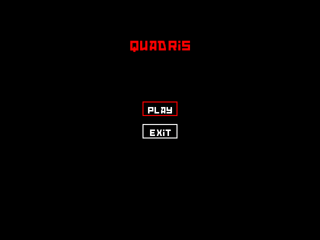
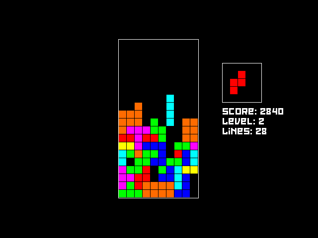
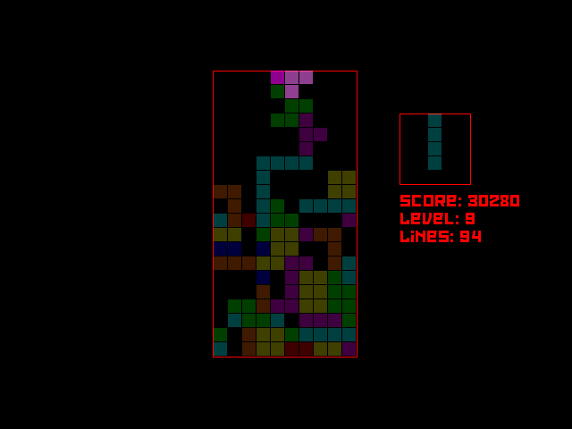

# Quadris

A simple Tetris clone loosely based on the ruleset of Tetris NES (1989).

## Improvements

- Cleaner UI and game mode code
- Better graphics (tetromino sprites, nicer overlay, line clear animation)
