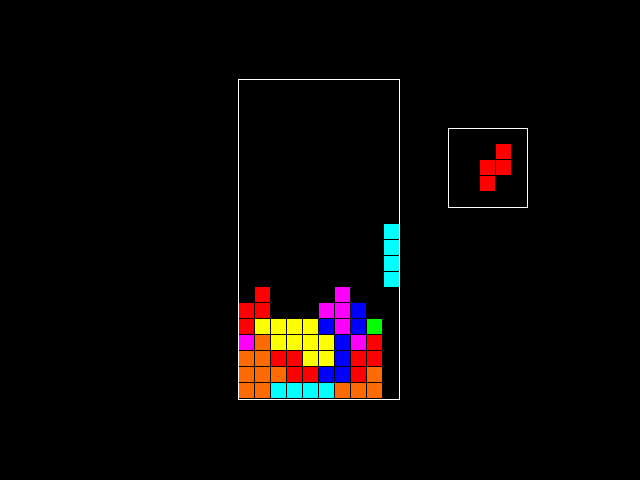

# Quadris

An unfinished Tetris game.

## More stuff to add

- Improved touch-down mechanic (store piece faster if collision occurs due to gravity or gliding)
- Score: line clear & time-based multipliers
- Level: speed up gravity over time
- Title screen (play / exit)
- Keep track of highscores
- Adjustable window resolution and well size
- Improved graphics (better looking tetrominoes and overlay)
